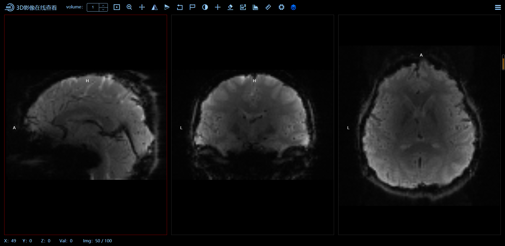
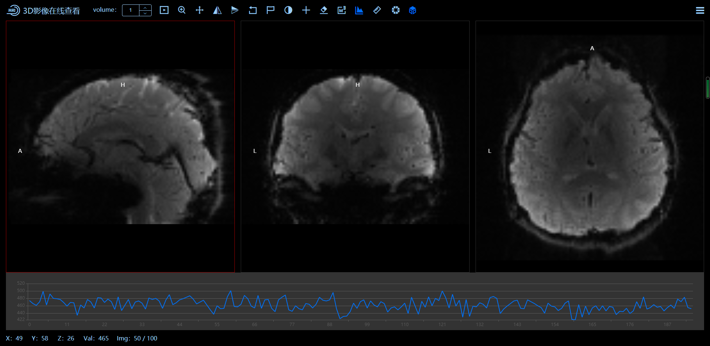
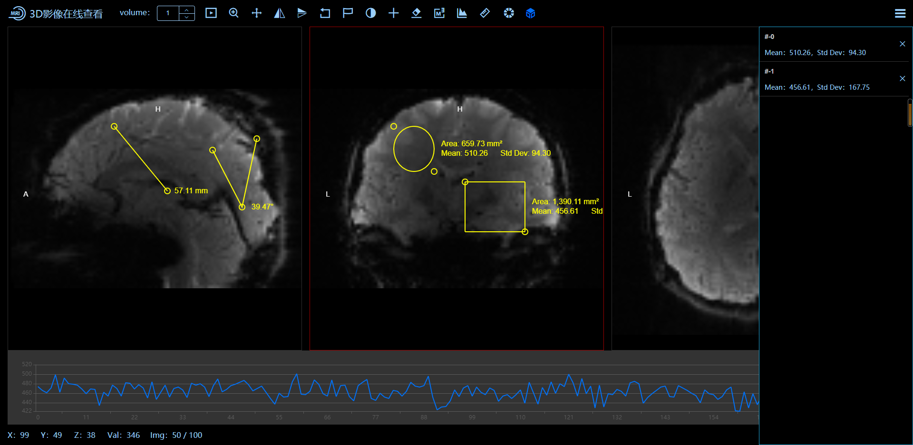
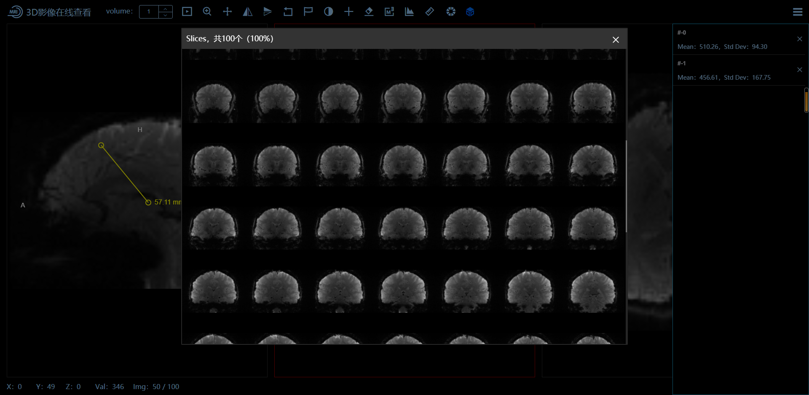
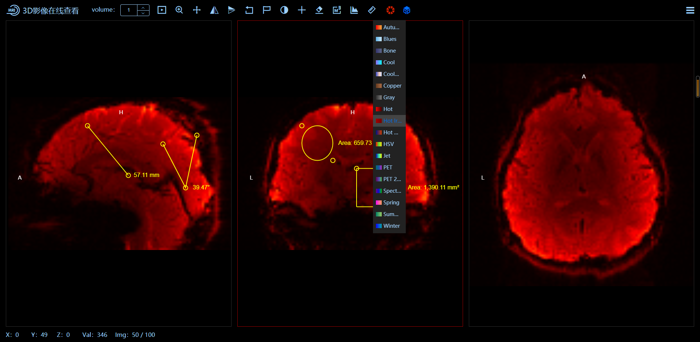
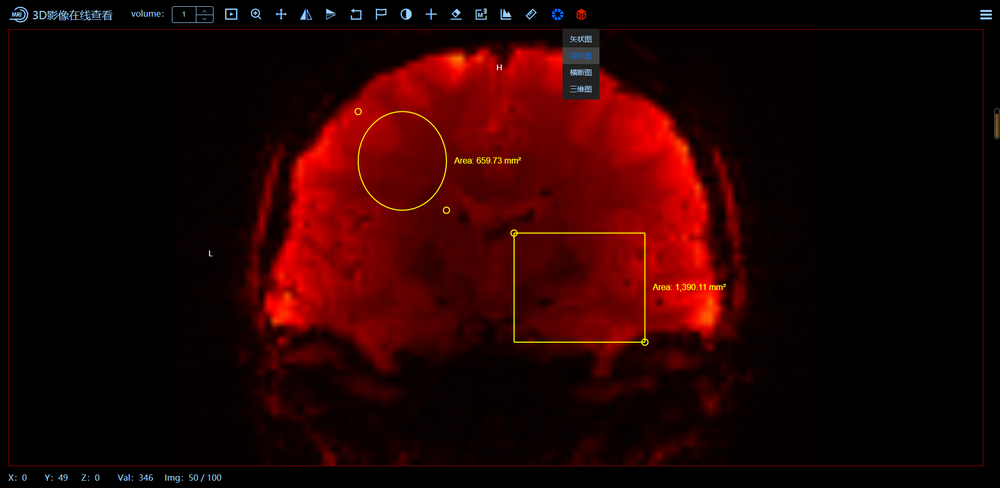
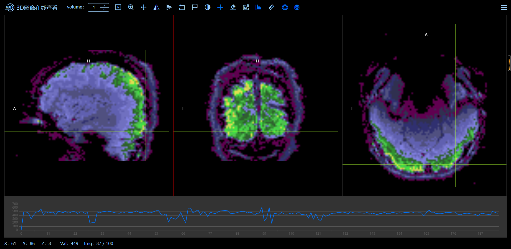

<!--
 * @Description:
 * @Version: 2.0
 * @Autor: wuwei3
 * @Date: 2020-08-13 10:47:10
 * @LastEditors: Please set LastEditors
 * @LastEditTime: 2020-11-19 11:19:55
-->

## 背景 儿童脑智影像子平台,MRI 影像模态数据中心质控核心模块

#### MRI 影像查看质控组件,主要应用与 MRI 影像质控业务场景，可实现 MRI 影像 3D 查看，质控标注，多维数据记录等功能

#### 组件实现包含：volume，度量工具，图层工具，切片工具，colorMap 和 TimeSeries

## Dicom-Demo 使用

```
参考项目：https://viewer.ohif.org/，地址：https://github.com/OHIF/Viewers

实现 ：vue + cornerstone ，地址：https://github.com/cornerstonejs

线上体验地址：https://wuwei.work/wb-mri/#/
```

## Project setup

```
npm install
```

### Compiles and hot-reloads for development

```
npm serve
```

### Compiles and minifies for production

```
npm build
```

2020.10.30 已更新至 1.0 稳定版，各功能已修复完善，开发使用中如有疑问，请联系 wuwei3@iflytek.com。

##### 系统界面基本介绍，因为是内网环境，如想使用该系统，请私聊一起学习交流，















<video id="video" controls="" preload="none">
    <source id="mp4" src="./src/asstes/home.mp4" type="video/mp4">
</video>
